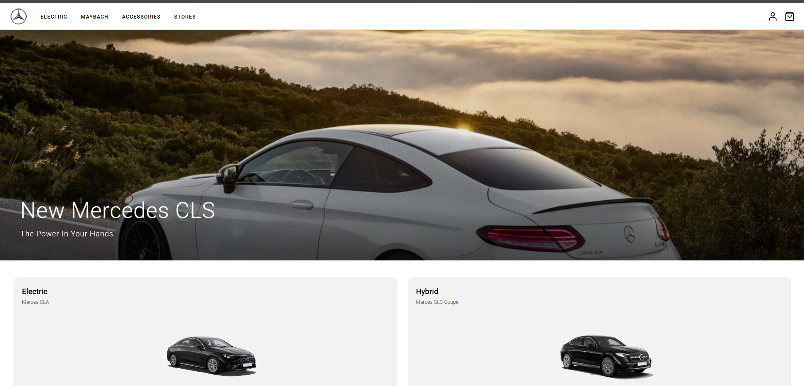
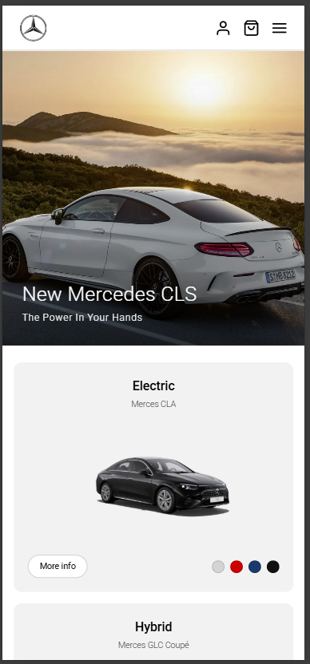

# 🚗 Mercedes-Benz — Landing Page

<div align="center">


<br/>

> **Práctica frontend** perteneciente al programa formativo **[The Powerd](https://thepower.education/)**.
> Maquetación completa de una landing page de Mercedes-Benz a partir de un diseño Figma,
> usando únicamente HTML semántico y CSS — sin una sola línea de JavaScript.

</div>

---

## 📋 Índice

- [Vista previa](#-vista-previa)
- [Descripción](#-descripción)
- [Características](#-características)
- [Tecnologías](#-tecnologías)
- [Estructura del proyecto](#-estructura-del-proyecto)
- [Instalación y uso](#-instalación-y-uso)
- [Decisiones técnicas destacadas](#-decisiones-técnicas-destacadas)
- [Contribución](#-contribución)
- [Licencia](#-licencia)

---

## 🖥️ Vista en navegador

<p align="center">
  
</p>

## 📱 Vista en móvil

<p align="center">
  
</p>

---

## 📖 Descripción

Este proyecto es una **landing page completa de Mercedes-Benz** desarrollada como práctica del programa formativo **The Powerd**. El objetivo es trasladar fielmente un diseño de Figma a código real, aplicando buenas prácticas de maquetación moderna.

El reto principal: **construir un menú hamburguesa funcional, tarjetas interactivas y un layout responsive completo sin utilizar JavaScript**, aplicando técnicas CSS avanzadas como el truco del checkbox.

---

## ✨ Características

| Característica | Descripción |
|---|---|
| 📱 **Responsive completo** | Diseño Mobile First adaptado a móvil, tablet y desktop |
| 🍔 **Menú hamburguesa sin JS** | Funcional mediante el truco CSS del checkbox |
| 🎨 **Variables CSS** | Sistema de diseño consistente con custom properties |
| ♿ **Accesibilidad** | Atributos ARIA, roles semánticos y `.sr-only` |
| 🔍 **SEO básico** | Meta etiquetas, `fetchpriority`, `loading="lazy"` |
| 📜 **HTML semántico** | Uso correcto de `header`, `main`, `section`, `nav`, `footer` |
| 🖱️ **Scroll horizontal** | Carrusel de características sin JS con `scroll-snap` |
| ✅ **W3C válido** | Sin errores de estándar HTML |

---

## 🛠️ Tecnologías

```
HTML5 ──────────── Estructura semántica y accesible
CSS3  ──────────── Flexbox, Grid, Custom Properties, Media Queries
Google Fonts ───── Roboto (300, 400, 500, 700)
Figma ──────────── Diseño de referencia (solo consulta)
```

**Sin frameworks. Sin librerías. Sin JavaScript.**

---

## 📁 Estructura del proyecto

```
mercedes-benz-landing/
│
├── index.html          # Estructura HTML completa
├── style.css           # Estilos globales y por sección
└── README.md           # Documentación del proyecto
```

### Secciones de la página

```
┌─────────────────────────┐
│         HEADER          │  Nav sticky + menú hamburguesa CSS
├─────────────────────────┤
│          HERO           │  Imagen full-width + texto superpuesto
├─────────────────────────┤
│        PRODUCTS         │  Grid de 4 tarjetas con colores
├─────────────────────────┤
│         DEALER          │  Mapa nocturno + tarjeta superpuesta
├─────────────────────────┤
│        FEATURES         │  Scroll horizontal tipo carrusel
├─────────────────────────┤
│         MAYBACH         │  Hero + layout split texto/imagen
├─────────────────────────┤
│         FOOTER          │  CTA banner + newsletter + links
└─────────────────────────┘
```

---

## 🚀 Instalación y uso

Este proyecto no tiene dependencias ni proceso de build. Solo necesitas un navegador.

### Opción 1 — Abrir directamente

```bash
# Clona el repositorio
git clone https://github.com/tu-usuario/mercedes-benz-landing.git

# Entra en la carpeta
cd mercedes-benz-landing

# Abre index.html en tu navegador
open index.html
```

### Opción 2 — Servidor local (recomendado)

```bash
# Con VS Code + extensión Live Server
# Clic derecho en index.html → "Open with Live Server"

# O con Python
python -m http.server 3000

# O con Node.js
npx serve .
```

> ⚠️ **Nota:** Si usas un bloqueador de anuncios, algunos elementos pueden verse afectados en local. Desactívalo para `localhost` durante el desarrollo.

---

## 💡 Decisiones técnicas destacadas

### Menú hamburguesa sin JavaScript

```css
/* El checkbox actúa como interruptor de estado */
.nav-toggle { display: none; }

/* Cuando está marcado, abre el nav mediante el selector ~ */
.nav-toggle:checked ~ header #nav-menu {
    transform: translateX(0);
}

/* El overlay también es un <label> que desmarca el checkbox al hacer clic */
.nav-toggle:checked ~ .sidebar-overlay {
    display: block;
}
```

### Mobile First con una sola media query

```css
/* Base: estilos para móvil */
.products__grid {
    grid-template-columns: 1fr;
}

/* Mejora progresiva para desktop */
@media (min-width: 769px) {
    .products__grid {
        grid-template-columns: 1fr 1fr;
    }
}
```

### Scroll horizontal nativo sin JS

```css
.features__track {
    display: flex;
    overflow-x: auto;
    scroll-snap-type: x mandatory;
    -webkit-overflow-scrolling: touch;
}

.feature-card {
    flex: 0 0 80vw;
    scroll-snap-align: start;
}
```

### Variables CSS para consistencia

```css
:root {
    --primary-color: #000000;
    --secondary-color: #ffffff;
    --accent-color: #cccccc;
    --font-family: 'Roboto', sans-serif;
    --font-serif: Georgia, 'Times New Roman', serif;
    --radius-card: 12px;
    --radius-pill: 20px;
    --transition: 0.3s ease;
}
```

---

## 🤝 Contribución

Este proyecto es una práctica educativa de **The Powerd**, pero las sugerencias son bienvenidas.

1. Haz un fork del repositorio
2. Crea una rama: `git checkout -b mejora/nombre-mejora`
3. Realiza tus cambios y haz commit: `git commit -m 'Añade: descripción del cambio'`
4. Sube los cambios: `git push origin mejora/nombre-mejora`
5. Abre un Pull Request

---

## 📄 Licencia

Este proyecto está bajo la licencia **MIT**.

```
MIT License — puedes usar, copiar, modificar y distribuir este código
siempre que mantengas el aviso de copyright original.
```

---

<div align="center">

Desarrollado con 🖤 como práctica de **[The Powerd](https://thepower.education/)**


</div>